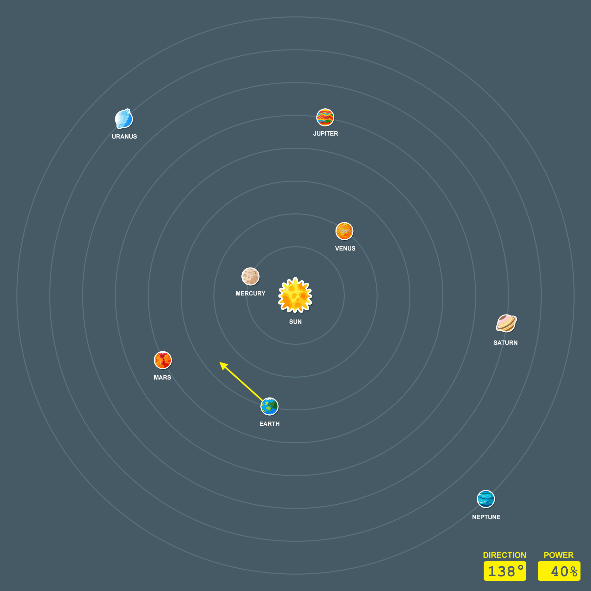

# Project 1 Proposal
### *Planet Hopper*

* **Person**[  ] Composition = *new* **Person**[4];
 * Composition[0] = Joshua Fan;
 * Composition[1] = Swati Gupta;
 * Composition[2] = Xiaoxiang Cao;
 * Composition[3] = Nitzan Orr;

#### Date:
**April 11th, 2016**

### Table of Contents
* 1.0 [Project Overview](#1.0)
  * 1.1 [Abstract](#1.1)
  * 1.2 [Target Customer](#1.2)
  * 1.3 [Search Words](#1.3)
  * 1.4 [Scope and Objectives](#1.4)
* 2.0 [Team and Constraints](#2.0)
  * 2.1 [Team Profile](#2.1)
  * 2.2 [Challenges](#2.2)
  * 2.3 [Assumptions and Constraints](#2.3)
* 3.0 [Deliverables and Milestones](#3.0)
  * 3.1 [Project Deliverables](#3.1)
  * 3.2 [Schedule and Budget Summary](#3.2)

## 1.0 Project Overview

#### 1.1 Abstract
***Planet Hopper*** is an educational game about the planets of the Solar System and the effects of gravity. The objective of the game is for a player to hop from one planet to another to find out information about the planet they landed on. A player must also plan their hops in a way that overcomes the force of gravity.

There are 8 planets in the Solar System, including Mercury, Venus, Earth, Mars, Jupiter, Saturn, Uranus, Venus. And the Sun.

This game will immerse the player in our Solar System, exploring it’s 8 planets and the force of gravity on a quest to visit all the planets. Through gameplay, the player will learn valuable information about each planet in our Solar System and what role gravity plays in the human endeavor of space exploration. However, landing on a planet is not an easy task since the player’s trajectory is affected by the force of gravity, emanating from each planet and the Sun.

The final product will be used by any person interested in exploring the Solar System on their own computer--no need for a spacesuit! The information gained by playing this fun and educational game will be valuable for many years to come since no change is due in the planet's’ characteristics for another 4.5 billion years...or 100 years if humans wreck the Earth. Play this while you still can...

#### 1.2 Target Customer
The clients of this product are parents and education institutions who wish to educate their children/students about the planets of the Solar System and the effects of gravity.  

In addition, any person interested in learning about the planets will be able to play.

* ***Users:***
 * K-12 Students
 * Children
 * Physics buffs

 

#### 1.3 Search Words
*Solar System, Planet, Planets, Gravity, Simulation, Simulator, Sun, Educational, Game, Planet Hopper, Hopper, Leapfrog*

#### 1.4 Scope and Objectives

The objective is to build a working system that is flexible and responsive to change. Via this group project the focus is on learning how to divide a big project into smaller doable parts, how to work in team and how to use each team members strong pursuit.

While following the agile process of software development, team has decided to take the simplest path and building a software system that can be used for entertainment and education. We may use existing codes, libraries and build on them.

##### *Features:*
* A desktop game built in Java
* Orbiting colored planets around Sun
* At the beginning of the game, player will be on planet Earth
* Game involves hopping from one planet to another
* Directions will be shown for hopping 	
* Once the player successfully hops from one planet to another, he/she is rewarded with the unique information about that planet
* For hopping, the player will have to use basic spatial and fine motor skills as well as a rudimentary understanding of the force of gravity.

##### *Design and Implementation:*
Welcome screen with an image of solar system and text box containing introductory information about the purpose of game. On the top of the screen there will be buttons for taking player to settings menu for volume and speed, for game rules. At bottom, three buttons for game control, exit, start and home.  
For implementing planet and player movement, we may use Slick2D, Java Swing.

###### *Prototype UI (Strictly for educational purposes)*

## 2.0 Team and Constraints

#### 2.1 Team Profile
* ***Josh***
 * Physics algorithms

* ***Swati***
 * Java Swing UI
 * CS 1A, 1B
 * Familiarity of database management systems

* ***Xiaoxiang***
 * Working knowledge in Science and Life Science
 * Proficiency in Git basics and rudimentary knowledge of advanced Git
 * Basic Markdown editing skills
* ***Nitzan***
 * Long experience with Java
 * Familiarity with Java API
 * CS 1A, 1B

 

#### 2.2 Challenges

* ***Non-Technical Challenges***
 * Designing a game that is educational, yet fun.
 * Advancing scope in small enough steps that all chosen features can be implemented in time.
* ***Technical Challenges***
 * Incorporating real-life data of the Solar System into the game in order to make it as accurate as possible.

 

#### 2.3 Assumptions and Constraints

* ***Non-technical Constraints***
 * Time
    * Each team member is taking other courses too
    * Less than 4 weeks to code.
 * Not all team members have a laptop
* ***Technical Constraints***
 * Implementation of advanced UI features will take time because of need to learn about them prior to coding.
 * Scalable design that will allow addition of possible features and continued maintainability
 * Team members are relatively new to Git/Github so working with it will be slow at first

 

## 3.0 Deliverables and Milestones<a name="abcde"/>

#### 3.1 Project Deliverables

* Project Proposal
* Installation instructions
* User Manual
* Source Code
* Screen Shots
* Presentation about final product and its development.

#### 3.2 Schedule and Budget Summary

| Item                       			| Date            |
| :--------------------------			|:----------------|
| Project Proposal      			   | Wed, April 13, 2016  |
| Proposal Presentation	          	| Thurs, April 14, 2016 |
| UI Design				               | Sat, April 16, 2016  |
| GUI starters		                  | Mon, April 18, 2016 |
| Class skeleton			            | Mon, April 18, 2016 |
| Orbiting algorithm  	       		| Thurs, April 21, 2016 |
| Sprint 1                   			| Thurs, April 21, 2016  |
| Functional solar system      	   | Sun, April 24, 2016  |
| Functional spaceship		      	| Wed, April 27, 2016  |
| Sprint 2                   			| Thurs, April 28, 2016  |
| Advanced UI for spaceship control | Sat, April 30, 2016  |
| Info boxes on planets		         | Sun, April 31, 2016  |
| Sprint 3                   			| Thurs, May 5, 2016  |
| Extra features if time allows		| Mon, May 9, 2016   |
| Demonstration and Delivery	    	| Thurs, May 12, 2016  |
